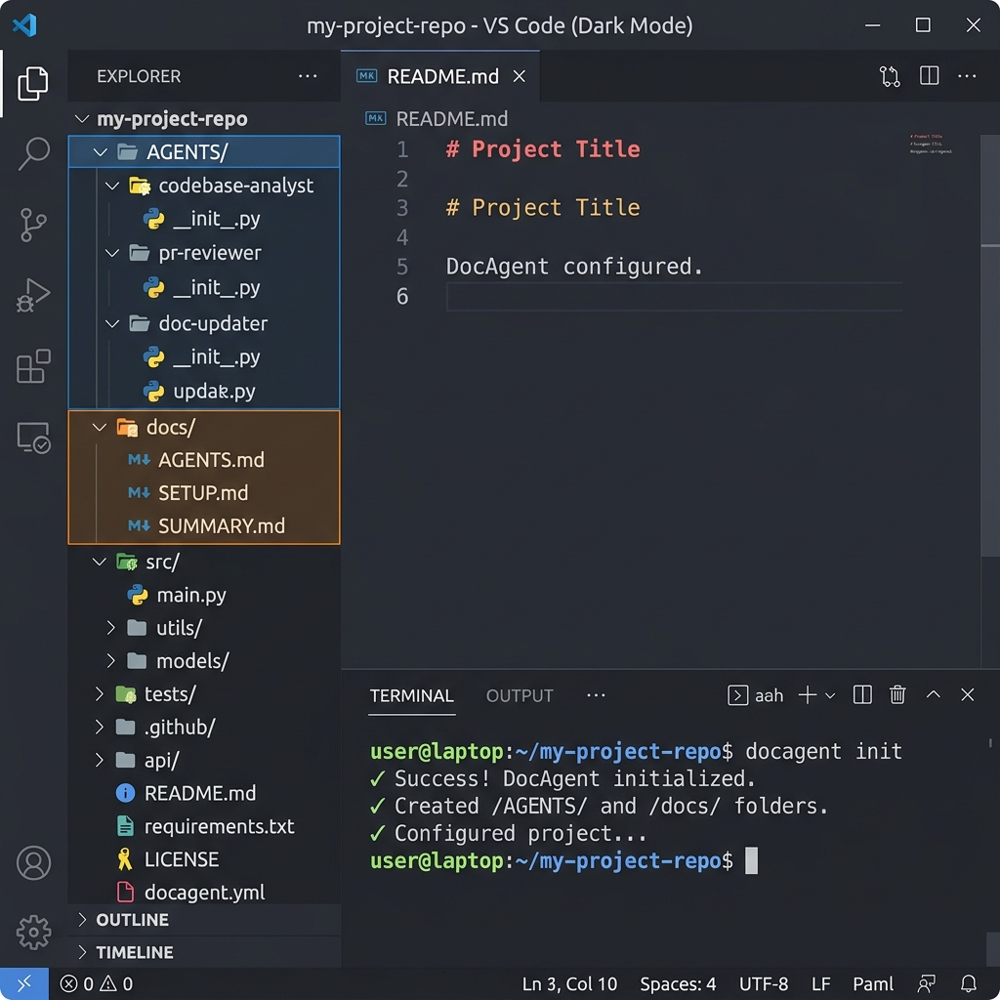

# doc-for-agent

English | [简体中文](README.zh.md)

[](docs/landing-page.md)

Public landing URL: add here when it is published.
Current landing entry doc: [docs/landing-page.md](docs/landing-page.md)

`doc-for-agent` is a unified CLI for CLI coding-agent users.

It is designed for Claude Code, Codex, CodeBuddy, Continue, Copilot, and similar terminal-first agent workflows.

It supports `agent`, `human`, `dual`, and `quad` outputs.
Mode map: `agent` writes `AGENTS/`, `human` writes `docs/`, `dual` writes both, and `quad` writes `AGENTS/`, `AGENTS.zh/`, `docs/`, and `docs.zh/`.
Dual mode keeps `docs/` (human docs) and `AGENTS/` (agent docs) paired in one refresh flow. Quad mode establishes the four-view directory contract for bilingual maintenance.
That four-view contract is a structure capability, not a claim that every bilingual view is already complete.
This is not an AGENTS-only tool: choose output mode by audience.

The product path is short:

1. install
2. `init`
3. `refresh`
Think of this as two and a half steps: global install makes the skill visible to the agent, repo-local `init` enables a repository workflow, and `refresh` writes or updates docs when you need them.
Simple path (`uipro-cli` style):
- `npm install -g doc-for-agent@next`
- `docagent init --ai codex`
- `docagent init --ai claudecode`

## 30-Second Start

Install once:

```bash
# Node users
npm install -g doc-for-agent@next

# Python users
pipx install doc-for-agent
```

Start in a repository:
Step 2 (repo-local init): enable the workflow in the target repository.
One-off `npx -y doc-for-agent init ...` combines both steps for temporary use. `refresh` remains the next step when you want docs written.

```bash
docagent init --ai codex
docagent init --ai claudecode
```

Use `--target <repo-root>` when you want the same command to wire a specific repository workflow.

Need a guided doc entry map? Run:

```bash
docagent quickstart --target <repo-root>
```

## Pick Your Agent

| If you use... | Run this first |
| --- | --- |
| Claude Code | `docagent init --ai claudecode` |
| Codex | `docagent init --ai codex` |
| CodeBuddy | `docagent init --ai codex --target <repo-root>` |
| Continue | `docagent init --ai continue --target <repo-root>` |
| GitHub Copilot | `docagent init --ai copilot --target <repo-root>` |
| Multiple agents | `docagent init --ai all` |

## Install Matrix

| User profile | Install path | Start command |
| --- | --- | --- |
| Node-first (global) | `npm install -g doc-for-agent@next` | `docagent init --ai all` |
| Node-first (one-off) | `npx -y doc-for-agent` | `npx -y doc-for-agent init --ai all --target <repo-root>` |
| Python-first (recommended) | `pipx install doc-for-agent` | `docagent init --ai all` |
| Python-first (venv/system) | `python3 -m pip install doc-for-agent` | `docagent init --ai all` |

## Product CLI v1

Primary flow commands:

```bash
docagent init --ai <codex|claudecode|all>
docagent refresh --root <repo-root> --output-mode agent|human|dual|quad
docagent doctor --target <repo-root>
```

Other primary commands:

```bash
docagent generate --root <repo-root> --mode refresh --output-mode agent|human|dual
docagent update --target <repo-root>
docagent versions --target <repo-root>
docagent quickstart --target <repo-root>
```

Legacy compatibility:

```bash
docagent install --platform codex --target <repo-root>
docagent all --target <repo-root>
```

## Docs

Entry docs path:

1. [Landing Page Note (EN)](docs/landing-page.md) / [落地页说明 (ZH)](docs/landing-page.zh.md)
2. [Quickstart (EN)](docs/quickstart.md) / [快速开始 (ZH)](docs/quickstart.zh.md)
3. [Platform Guide (EN)](docs/platforms.md) / [平台指南 (ZH)](docs/platforms.zh.md)

Use this chain for dual-system onboarding: product framing -> first run -> platform choice.

Maintainer docs:

- [Maintainer Guide](docs/maintainers.md)
